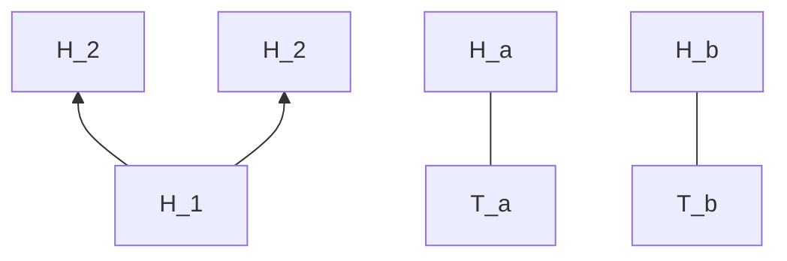
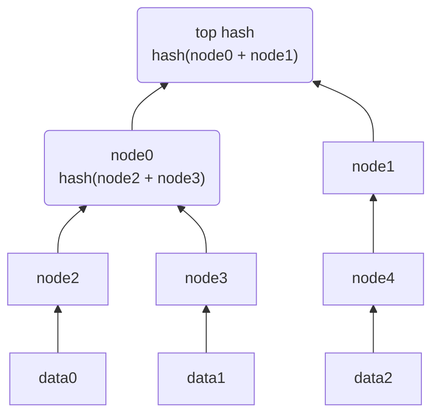

## Merkle trees

A merkel tree is a tree implementation in which every "leaf" node (leaf node is the single node at the bottom without children) is labelled with hash of a data block. Each non-leaf has the labelled hash of it's children's hash.
The benefits of a merkle tree or a hash tree is that it allows for efficient and secure verification of the contents of a large data structure.

### why
- The Merkle tree is useful because it allows users to verify a specific transaction without downloading the whole blockchain (over 350 gigabytes for bitcoin for example).

Hash trees can be used to verify the contents or data of a transferred between computers. They can also be used to help verify undamaged, unaltered datablocks in a peer-to-peer network. They are used in products like [[ipfs]] , [[git]] , [[bittorrent]], [[bitcoin]], [[ethereum]], nix package manager (Except that in the Nix object store, objects are not named by the SHA hash of their contents, but rather SHA hash of their build rules + their direct dependencies.).

Demonstrating that a leaf node is part of a given binary hash tree requires computing of the log of the tree size. This makes merkle trees useful for a cryptographic application of commmitment verification schemes. Which the root of the tree is the commitment and the leaf node is the message.

### nounce

### how does a new leaf node get added to the tree
A new "commitment" to the scheme is created by hashing the message with a random value called a "nonce". The nonce is then used to create a new commitment to the scheme. The new commitment is then hashed with the nonce to create a new commitment to the scheme. This process is repeated until the desired number of commitments is reached. The final commitment is then used to verify the message. 

