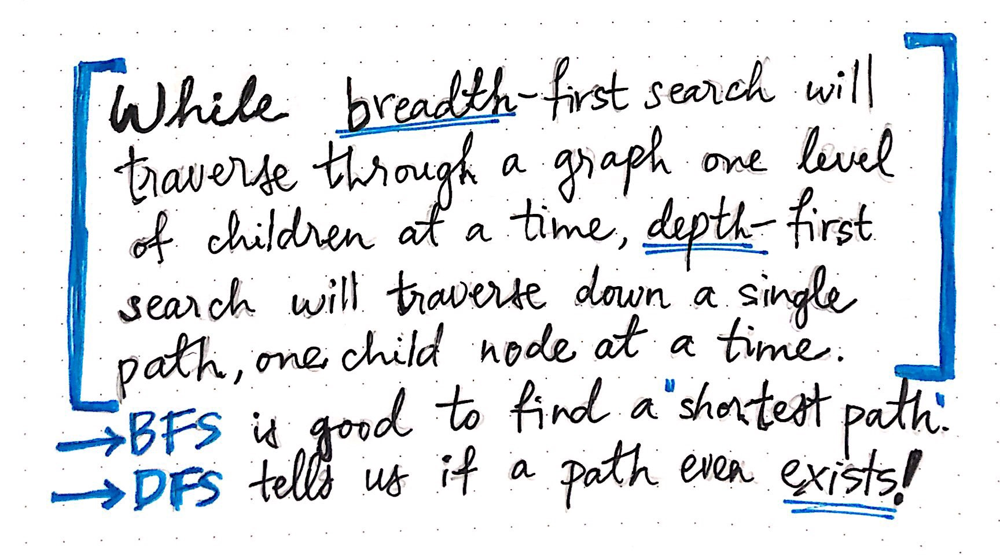

# Introduction to BFS (breadth first search)

As always we want to start of by talking about why we would actually be learning this material. BFS is a algorithm used to traverse a set of paths to find the "shortest path" to something in a graph problem; solving problems such as minimum steps of solving the Rubik's Cube. Do not get discouraged because of solving it as a graph; since most problems can be converted into a graph problem and sometimes in a few steps. Why are we getting the "shortest" path tough; we are searching on a broad approach and exploring the field within that level fully before actually traversing to the next level of depth of a problem. For example analyzing networks, mapping routes, and scheduling are graph problems.


> BFS is a algorithm used to traverse a set of paths to find the "shortest path" to something in a graph problem; solving problems such as minimum steps of solving the Rubik's Cube

---
## BFS vs DFS
The act of searching or traversing through a graph data structure is fairly simple: it just means that we’re probably visiting every single vertex (and by proxy, every single edge) in the graph. At it’s very core, the only difference between traversing a graph by breadth or by depth is the order in which we visit the vertices in a graph. In other words, the order in which the vertices of a graph are visited is actually how we can classify different graph traversal algorithms.
In both tree and graph traversal, the DFS algorithm uses a stack data structure. By comparison, the breadth-first search algorithm traverses broadly into a structure, by visiting neighboring sibling nodes before visiting children nodes. In both tree and graph traversal, the BFS algorithm implements a queue data structure.



> In both tree and graph traversal, the DFS algorithm uses a stack data structure. By comparison, the breadth-first search algorithm traverses broadly into a structure, by visiting neighboring sibling nodes before visiting children nodes. In both tree and graph traversal, the BFS algorithm implements a queue data structure.

## Algorithm
The backbone of a breadth-first search consists of these basic steps:
* Add a node/vertex from the graph to a queue of nodes to be “visited”.
* Visit the topmost node in the queue, and mark it as such.
* If that node has any neighbors, check to see if they have been “visited” or not.
* Add any neighboring nodes that still need to be “visited” to the queue.
* Remove the node we’ve visited from the queue.

## Real world example
```python
# [200] Number of Islands
#
# https://leetcode.com/problems/number-of-islands/description/
#
# algorithms
# Medium
#
# Given a 2d grid map of '1's (land) and '0's (water), count the number of
# islands. An island is surrounded by water and is formed by connecting
# adjacent lands horizontally or vertically. You may assume all four edges of
# the grid are all surrounded by water.
#
# Example 1:
#
#
# Input:
# 11110
# 11010
# 11000
# 00000
#
# Output: 1
class Solution:
    def numIslands(self, grid: List[List[str]]) -> int:
        """
        :type grid: List[List[str]]
        :rtype: int
        """
        if not grid or not grid[0]:
            return 0

        num_count = 0
        for i in range(len(grid)):  # <-- x
            for j in range(len(grid[i])):  # <-- y
                if grid[i][j] == "1":
                    self.bfs(grid, i, j)
                    num_count += 1

        return num_count


    def bfs(self, grid, r, c):
        queue = collections.deque()
        queue.append((r, c))
        grid[r][c] = "0"
        while queue:
            directions = [(0, 1), (0, -1), (-1, 0), (1, 0)]
            r, c = queue.popleft()
            for d in directions:
                nr, nc = r + d[0], c + d[1]
                if self.is_valid(grid, nr, nc) and grid[nr][nc] == "1":
                    queue.append((nr, nc))
                    grid[nr][nc] = "0"

    def is_valid(self, grid, r, c):
        m, n = len(grid), len(grid[0])
        if r < 0 or c < 0 or r >= m or c >= n:
            return False
        return True
```
