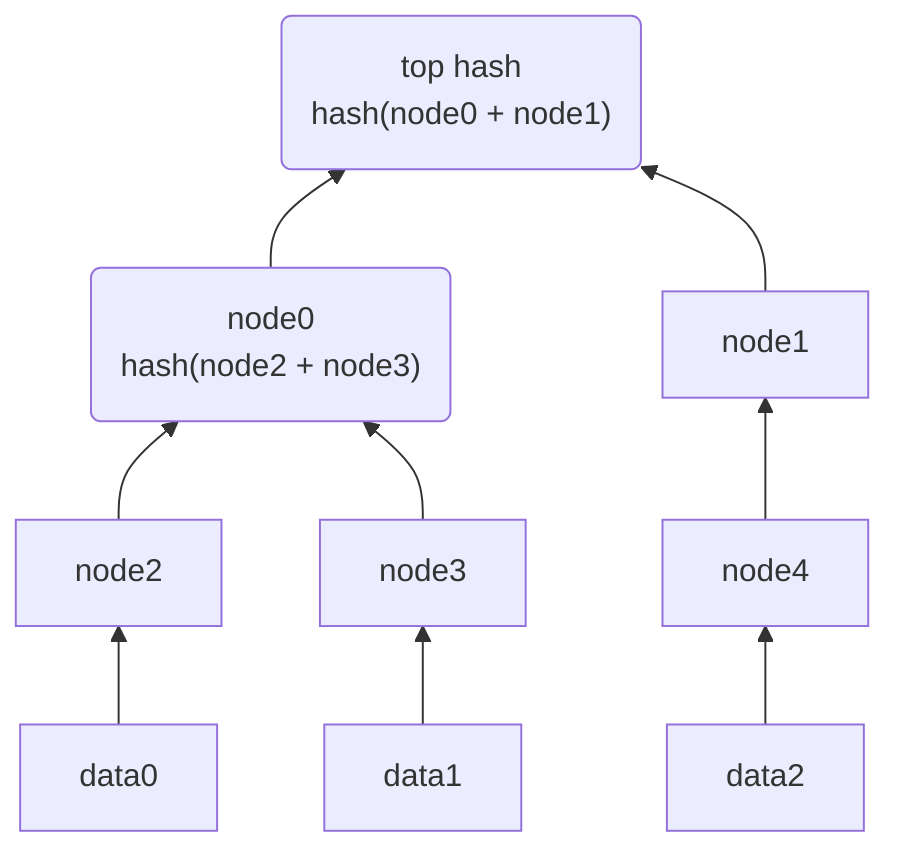

## Merkle trees

A merkel tree is a tree implementation in which every "leaf" node (leaf node is the single node at the bottom without children) is labelled with hash of a data block. Each non-leaf has the labelled hash of it's children's hash.
The benefits of a merkle tree or a hash tree is that it allows for efficient and secure verification of the contents of a large data structure.
Hash trees can be used to verify the contents or data of a transferred between computers. They can also be used to help verify undamaged, unaltered datablocks in a peer-to-peer network. They are used in products like [[ipfs]] , [[git]] , [[bittorrent]], [[bitcoin]], [[ethereum]], nix package manager (Except that in the Nix object store, objects are not named by the SHA hash of their contents, but rather SHA hash of their build rules + their direct dependencies.).

